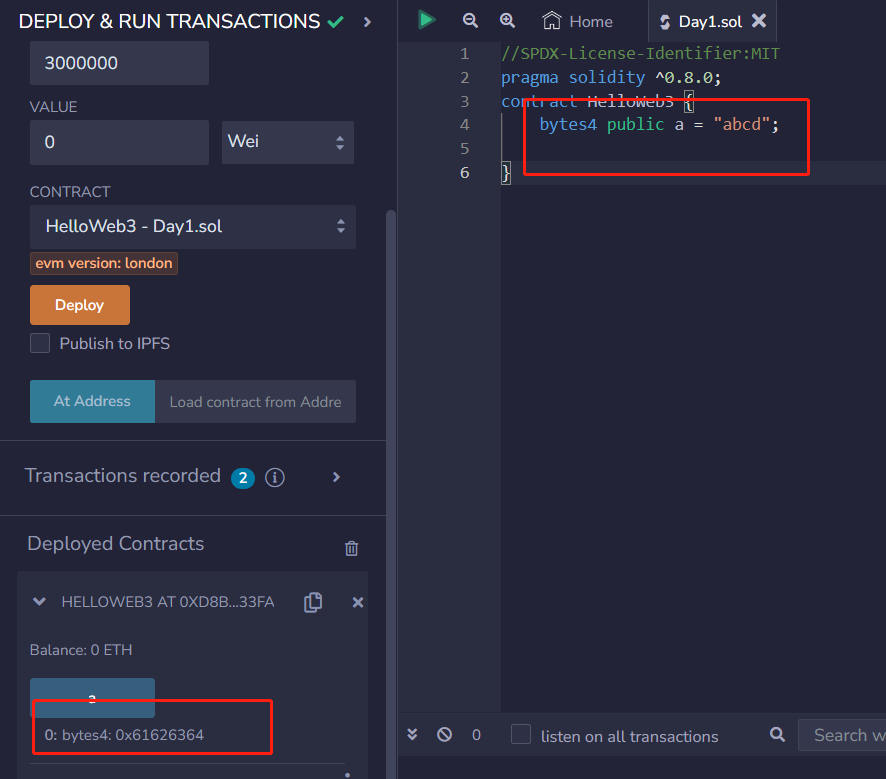
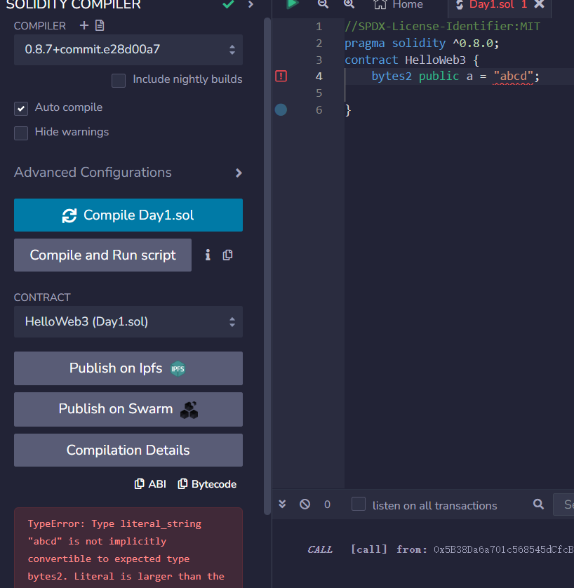
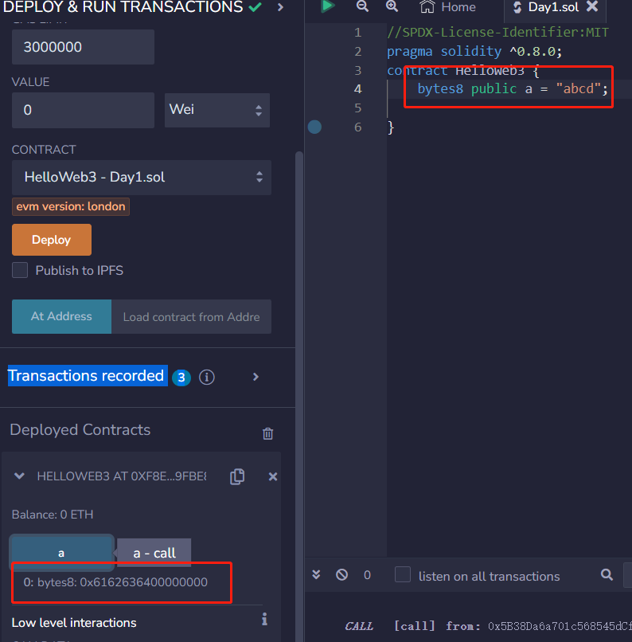

# 7.31教学基础知识补充
## 比特，字节，字

+ 比特  
比特bit是二进制位的简称，是计算机内部数据存储的最小单位。bit取值为0或1
+ 字节
字节Byte是计算机数据处理的最小单位，1字节=8bit
+ 字
字由若干个字节组成，一个字节是8个比特bit。字的位数叫做字长，即cpu一次处理二进制代码的位数。字的长度与计算架构有关
    1. 32位计算机：1字=32位=4字节=8位16进制数
    2. 64位计算机：1字=64位=8字节=16位16进制数

## UTF-8编码
UTF-8编码使用1到4个字节来表示每个字符，支持几乎所有的语言和字符集，包括中文、日文、韩文、阿拉伯文、希腊文等等  
UTF-8编码根据Unicode数据集实现字符值与码值之间的一一映射,下面是Unicode编码的几个示例
示例  
字符6的Unicode编码为36，H的Unicode编码为48，h的Unicode编码为68，$\alpha$ 的Unicode编码为945，中的Unicode编码为20013

## 字节数组和字符串的转化  
数组是一种数据结构，可以容纳多个相同类型的元素。这些元素可以通过索引来访问和操作。字节数组是一种特殊的数组，其中每个元素都是一个字节。
```solidity
//字节数组示例
bytes4 public a= "abcd";
// 输出 >> a=0x61626364  其中0x表示16进制  61为a对应的unicode编码，62为b对应的unicode编码，63为c对应的unicode编码，64为c对应的unicode编码。

//如果在字节数组大小小于字符串对应大小时会发生报错

//如果在字节数组大小大于字符串大小时，空出来的位置用0补充
bytes8 public a = "abcd";
//>> a=

```


remix演示  
  
字节数组大小等于字符串对应大小


  
字节数组大小小于字符串对应大小


 
字节数组大小大于字符串对应大小

